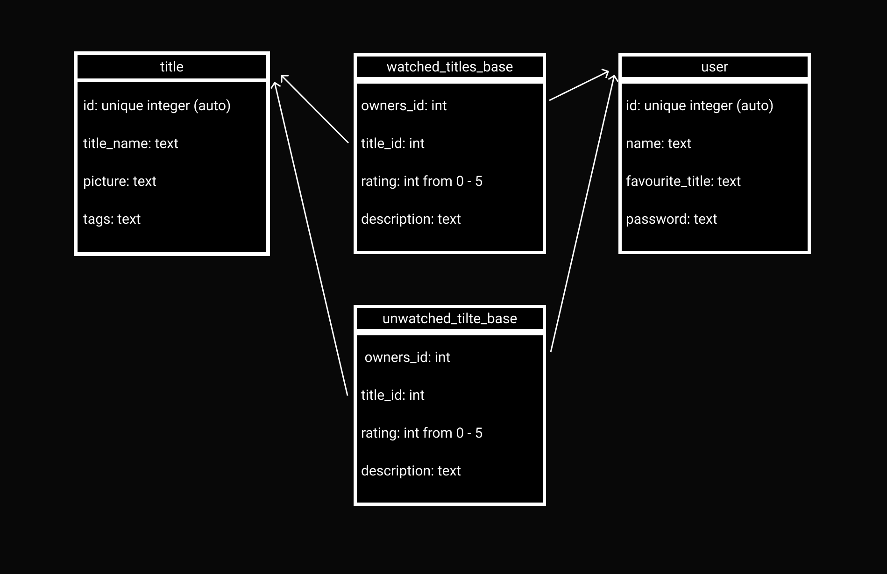

# Add Anime List (cs-50 final project)

### Video Demo: https://youtu.be/4AUp4WB7CFg

#### Anime Watch List - is a web-app where you can track all anime titles you have ever watched or you are gonna watch once. There you can add titles, rate them and give a specific description.
**1. How to use ?**

**2. Implementation**
## How to use ?
As you can see this project is a web-app, so to use it you should have a web server. Since I didn’t have a server to use this software you have to run the server on your own. Don’t be afraid of it, it is quite easy. Here is step-by-step tutorial:
  1. Download Python.
  2. Download Flask.
  3. Clone this repository
  4. Open terminal and move to the folder with the project (a folder, where app.py is located).
  5. Type “python -m flask run”.
  6. You will see a line with the words “Running on …” and the link.
  7. Press the link or copy it and use your browser (I recommend using Chrome).
  8. That’s all! You are excellent! I hope you’ll enjoy my web-app <3.

## Implementation
This web-app consists of three parts:
1. Backend, using python and flask.
2. Frontend, using HTML, CSS, Javascript and JQuery.
3. Database, managed by “sqliteadmin” software.
Let’s see implementation of every part of this web-app.

## Backend:
As I said before, I used python and flask to create the backend. There are 3 python files: app.py, help.py and json-to-sql.py. Let’s look closer to each file.
### app.py
The app.py file contains a number of routes for client to work with server. First of all is the main function. It just returns the main html web page. Then  we have getAnimeList. When we call that function we pass it the whole or part of the title’s name and then it searches through a database of the anime titles and returns a list of the titles where their names match the argument clients have passed. The register function just returns a register.html page. The registered function checks if there’s any mistake in the register form and if not adds the user to the user's database and returns to the main page. The login function just returns login.html. The loginned function is similar to the registered function. The main difference is that the loginned function doesn’t make any new data but checks data that the server already has. The GetTitles function returns a list of titles that user have watched or list of titles user would want to see. Type of list demands on “mode” value. If it is “watched”, then it returns the first list, if it’s “unwatched” it returns the second one. The AddTitle function check’s correctness of AddTitle form and if the data is correct adds the title to watched_titles_database or unwatched_titles_database. 
### help.py
This file contains functions to make working with databases easier and one function that main purpose is to don’t let users that are not loginned to get access to some routes. The LoginRequired is that very function. The GetWatchedTitles takes the user's ID as an argument and returns an array where each element is the title that the user has watched. Each element is a dictionary. GetUnwatchedTitles is a similar function, but it returns a list of titles that the user hasn’t watched. The GetTitle function takes the name of the title and returns the title itself. The AddRowToTitlesTable takes information about the title and adds the title to the database. The AddRowToUserTable function is similar to the AddRowToTitlesTable function. The CheckExisting function takes the user's name and checks if there is a user with that name in the users table. The GetTitlesLike function takes the title's name as an argument and returns a list of the titles with similar names. The GetUserId function takes the user’s name and returns the id of the user.  The AddToWatchedTitles function takes a dictionary with information about the title and adds it to watched_titles_base. Also it uses the user's id but it doesn’t take it as an argument and gets it using flask.session dictionary. The AddToUnwatchedTitles function works in the same way. The CheckPassword function takes the password that the user provided and username and checks if the user typed the right password.

## Frontend:
All frontend files are located in static and templated folders as in every flask app. 

**Template folder stores html files:**
  - layout.html - there are common elements that you can see in different pages of my web-app like background and logo.
  - login.html - page with login form via user can login.
  - main.html - main page. The biggest html file because it has form, multiple buttons and different links.
  - register.html - page with register form via user can register.

**Static folder stores css and javascripts files:**
  -layout.css, login.css, main.css, register.css - files with style for corresponding html files. They are ordinary but one feature inside the main.css file is something interesting. I was wondering how to store images inside html files. The  tag couldn’t fit in my project because it did not have enough features. Inside the main.html file is 
 tag with class “m_image”. There was nothing inside it, because I managed to put it in an image using the “background-image” css property. Thanks to that, the image fits better in div with “m_image” class and lets me center it inside using “background-position” and “background-size” properties.
- main.js - it has couple of functions that let the web-app to do couple of things:
   1. Load titles (image, description, genres, rating) using ajax requests.
	 2. Show AddTitle window by clicking AddTitle button.
	 3. Make anime tiles interactive.
  - register.js - js file with just one function that shows appropriate up to 10 anime titles when users press key while filling “You favorite title” form.
  - script.js - js file with just one function that shows an error window when an error occurs.

## Database
My project uses sql database “anime.db”. Image below shows scheme of the database.

